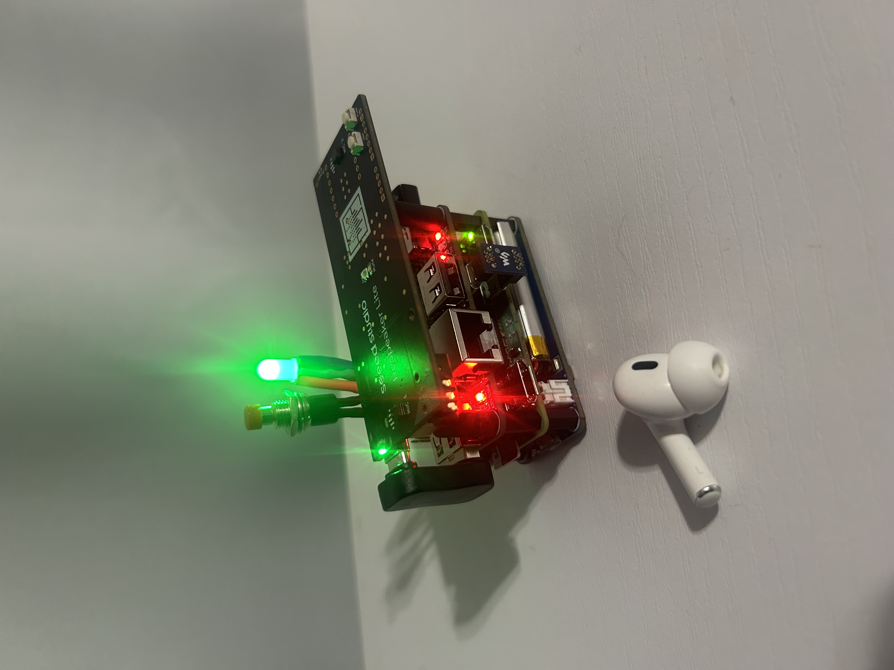
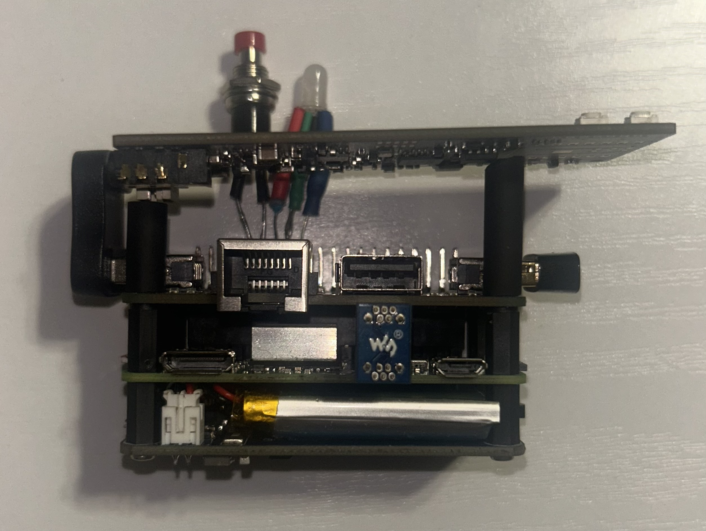
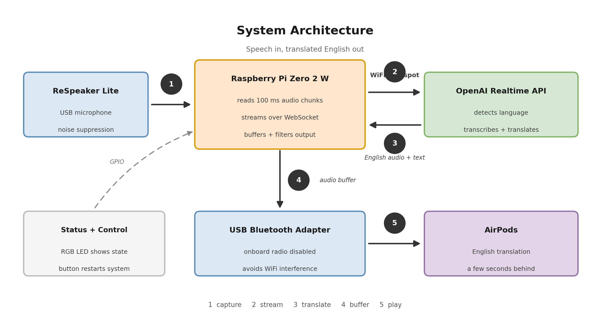
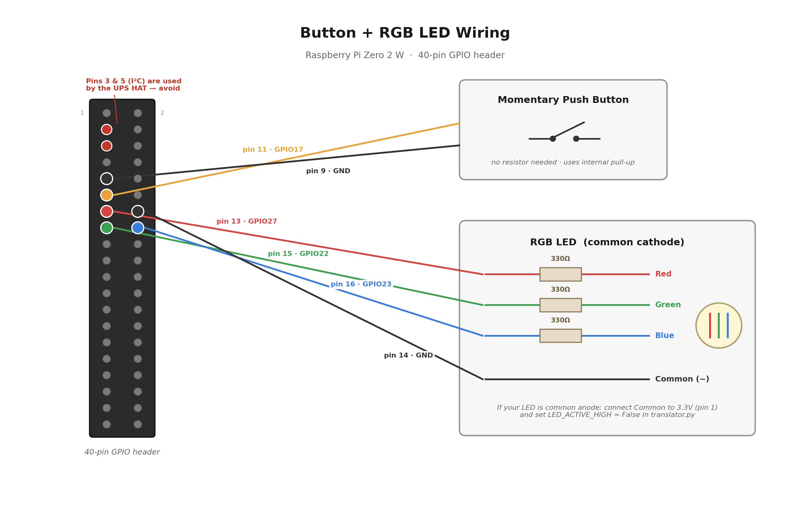

<p align="center">
  
</p>

# Real-Time Speech Translator

<p align="center">
  
  
  
  
  
</p>

A self-contained, wearable translator that listens to almost any spoken language and plays an English translation into your AirPods within a few seconds — no phone, no app, and no screen required. The entire system runs on a $15 Raspberry Pi Zero 2 W with a battery, so it can be turned on and used anywhere with internet access.

It detects the spoken language automatically, switches between languages with no setup, and stays silent when the speaker is already speaking English.

> ⚠️ This repository is still being documented — more diagrams and build notes will be added soon.
> 🎥 See it in action below!

---

# 🎥 Demo

- **[Demo Video](media/demo.mp4)** – The translator running live: foreign speech in, English out through the AirPod, switching between multiple languages with no configuration.

---

# 📸 System Photos

### **Board Stack**


The full stack laid flat: the UPS battery HAT on the bottom, the Raspberry Pi Zero 2 W in the middle, and the USB hub HAT on top carrying the microphone and Bluetooth adapter. The button and status LED are wired to the Pi's GPIO header.

---

# 🌍 Project Background

Commercial translation earbuds like Timekettle and Pixel Buds do not actually translate anything in the earbuds — they are microphones and speakers paired to a phone that does the real work. Standalone translator devices like Pocketalk are essentially small Android phones.

I wanted to find out whether the same thing could be done without a phone at all, on the cheapest capable hardware I could find, as a completely self-contained device.

The result is a translator that:

- Runs entirely on a Raspberry Pi Zero 2 W with 512MB of RAM
- Boots straight into translating mode when powered on
- Requires no screen, keyboard, app, or phone
- Automatically detects the language being spoken
- Costs roughly $65 in parts

The tradeoffs are that it needs an internet connection (a phone hotspot works) and runs on battery, so runtime is limited.

---

# 🛠 System Overview

## Hardware

| Component | Purpose |
|-----------|---------|
| Raspberry Pi Zero 2 W | Main computer, runs the whole pipeline |
| ReSpeaker Lite (USB) | Microphone with onboard noise suppression and beamforming |
| USB Bluetooth Adapter | Connects to AirPods (onboard Bluetooth is disabled) |
| USB Hub HAT | Adds USB ports for the microphone and Bluetooth adapter |
| UPS HAT + Battery | Portable power and charging |
| RGB LED + Button | Status display and restart control (GPIO) |
| 32GB microSD + heatsink | Storage and thermal management |

Hardware diagrams are stored in the **[`hardware/`](hardware/)** folder.

---

# 🧩 How It Works

## Audio Pipeline

[View system_architecture.png](hardware/system_architecture.png)

<p align="center">
  
</p>

The flow from speech to translated audio:

1. **Capture** — the ReSpeaker microphone records raw audio and the software reads it in 100ms chunks
2. **Stream** — those chunks are sent continuously over WiFi to OpenAI's Realtime Translation API through a WebSocket connection
3. **Translate** — the model transcribes the source language, detects what language it is, and returns translated English audio and text
4. **Buffer** — returned audio is held in a bounded buffer that drops old audio if Bluetooth playback falls behind, which prevents latency from stacking up over a long conversation
5. **Play** — audio is written to PipeWire and out through the Bluetooth adapter to the AirPods

## Wiring

[View wiring_diagram.png](hardware/wiring_diagram.png)

<p align="center">
  
</p>

The button and RGB LED connect directly to the Pi's GPIO header. All other components connect over USB through the hub HAT.

| Component | GPIO (BCM) | Physical Pin |
|-----------|-----------|--------------|
| Button | GPIO17 | Pin 11 |
| Button GND | — | Pin 9 |
| LED Red | GPIO27 | Pin 13 |
| LED Green | GPIO22 | Pin 15 |
| LED Blue | GPIO23 | Pin 16 |
| LED GND | — | Pin 14 |

Each LED color leg needs a 330Ω resistor. Note that the UPS HAT uses GPIO2 and GPIO3 (I²C) for battery monitoring, so those pins are unavailable.

---

# 💡 Status LED

Because the device has no screen, the RGB LED reports what the system is doing:

| Color | Meaning |
|-------|---------|
| 🔵 Blinking Blue | Waiting for an internet connection |
| 🟦 Blinking Cyan | Waiting for a Bluetooth controller |
| ⚪ Solid White | Connecting to AirPods |
| 🟢 Solid Green | Live and translating |
| 🔴 Solid Red | Startup failed, restarting automatically |

Holding the button for 3 seconds triggers a clean restart of the whole system without needing a keyboard or screen.

---

# 🧠 Notable Engineering Problems

### Running everything at once on 512MB of RAM
Bluetooth audio, WiFi streaming, and continuous audio processing all competing for memory on a Pi Zero 2 W caused swap thrashing and severe audio lag. Disabling the desktop environment and running the translator as a background service instead of through a remote editor freed enough memory to keep latency low.

### Radio interference
The Pi Zero 2 W shares a single antenna between WiFi and Bluetooth, which caused constant audio dropouts while streaming in both directions at once. Moving Bluetooth to a separate USB adapter and disabling the onboard Bluetooth radio (`dtoverlay=disable-bt`) resolved it.

### Suppressing English
The translation model sometimes echoes speech back unchanged when the input is already English. The software compares the source transcript against the translated transcript using string similarity and mutes playback for that phrase when they are nearly identical.

### Bluetooth recovery
Bluetooth adapters can fail or drop mid-session. A watchdog thread independently checks the connection state on a timer and reconnects automatically, escalating to a Bluetooth service restart or a USB reset if the connection stays down.

---

# 🚀 Getting Started

## 1. Clone the repo
```bash
git clone https://github.com/TobyM-engineering/Real-Time-Speech-Translator.git
cd Real-Time-Speech-Translator
```

## 2. Install dependencies
```bash
sudo apt install -y python3-venv swig python3-dev liblgpio-dev
python3 -m venv .venv
source .venv/bin/activate
pip install websocket-client python-dotenv gpiozero lgpio
```

## 3. Add your API key
Create a `.env` file in the project folder:
```
OPENAI_API_KEY=your_key_here
```
> ⚠️ Never commit this file. It is already listed in `.gitignore`.

## 4. Disable onboard Bluetooth
The onboard radio shares an antenna with WiFi and causes dropouts:
```bash
echo "dtoverlay=disable-bt" | sudo tee -a /boot/firmware/config.txt
sudo reboot
```

## 5. Pair your headphones
```bash
bluetoothctl
power on
scan on
trust XX:XX:XX:XX:XX:XX
pair XX:XX:XX:XX:XX:XX
connect XX:XX:XX:XX:XX:XX
```
Then update `AIRPODS_MAC` in `software/translator.py` with your device's address.

## 6. Run it
```bash
python3 software/translator.py
```

## 7. Run automatically on boot
```bash
mkdir -p ~/.config/systemd/user
cp docs/translator.service ~/.config/systemd/user/
systemctl --user daemon-reload
systemctl --user enable translator.service
sudo loginctl enable-linger $USER
```

After this, the device boots directly into translating mode when powered on.

---

# 📌 Repo Status

✅ Working end-to-end translation

✅ Automatic language detection

✅ Boots headless with LED status and button control

⚙️ Single-word translation fallback (works inconsistently)

🔧 Bluetooth stability improvements in progress

---

# 📂 Repository Structure

```
Real-Time-Speech-Translator/
│
├── software/
│   └── translator.py
│
├── docs/
│   ├── setup.md
│   ├── how_it_works.md
│   └── translator.service
│
├── hardware/
│   ├── wiring_diagram.png
│   └── system_architecture.png
│
├── media/
│   ├── device_powered_on.jpg
│   ├── board_stack.jpg
│   └── demo.mp4
│
├── .gitignore
├── LICENSE
└── README.md
```

---

Anyone is welcome to clone or fork this project to learn from it or build their own version.
